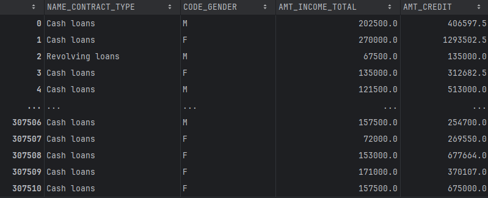

# Kaggle Contest Submission: Default Risk Calculation

This repository contains my code and data for a past Kaggle contest organized by Home Credit Group. The aim of the contest was to calculate the risk of home credit default for various users based on certain factors using linear regression. The project involved significant data cleaning and preprocessing steps to ensure accurate predictions.

## Project Overview

In this project, I focused on calculating the default risk of various users by employing a linear regression model. The primary tasks included:

1. **Data Cleaning**: Handling missing values, outliers, and incorrect data entries.
2. **Feature Engineering**: Creating new features and selecting the most relevant ones for the model.
3. **Model Training**: Training a linear regression model to predict default risk.
4. **Model Evaluation**: Assessing the model's performance using appropriate metrics.

## Data Cleaning

Data cleaning was a crucial step in this project. The raw data contained several issues that needed to be addressed before training the model. Below are the images showing the data before and after cleaning:

### Data Before Cleaning

### Data After Cleaning

The cleaning process involved:
- Imputing missing values
- Removing outliers
- Correcting data entry errors
- Normalizing and standardizing the data

## Linear Regression Model

The linear regression model was used to predict the default risk of users. The model was trained using the cleaned dataset and various features that were engineered to enhance predictive accuracy.

### Features
The features used in the model included:
- User demographics (age, income, employment status, etc.)
- Financial history (credit score, past defaults, etc.)
- Other relevant factors (loan amount, interest rates, etc.)

### Model Performance
The performance of the linear regression model was evaluated using metrics such as Mean Squared Error (MSE), R-squared, and others. The model achieved a score of 0.73, indicating a reasonable level of accuracy in predicting default risk.

## Conclusion

This project demonstrated the importance of data cleaning and feature engineering in building a reliable predictive model. By carefully preprocessing the data and selecting relevant features, the linear regression model was able to achieve a decent performance in predicting default risk.
